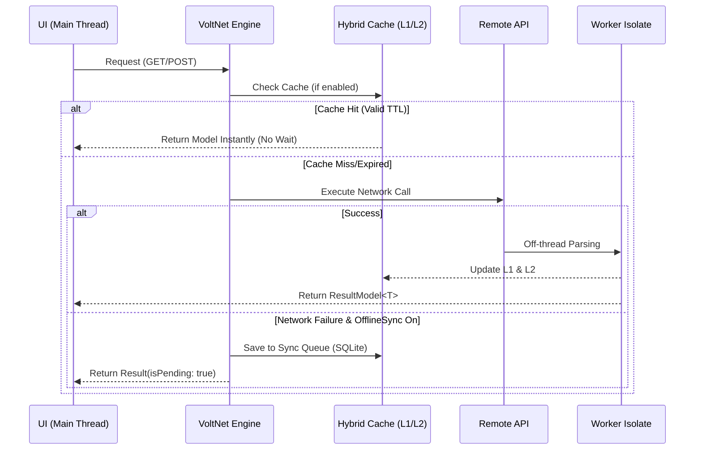
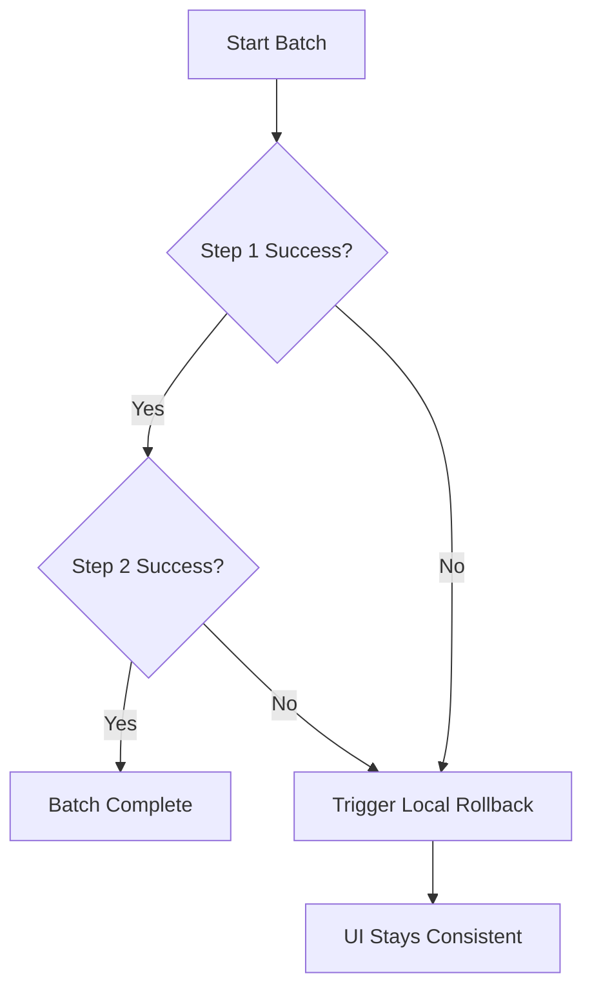

# VoltNet 🚀 — Enterprise Networking for Flutter

[](https://pub.dev/packages/volt_net)
[](https://github.com/felippe-flutter-dev/volt_net)
[](https://opensource.org/licenses/MIT)

### Why VoltNet?
In complex Flutter apps, network failures are inevitable. VoltNet isn't just an HTTP client; it's a **resilient orchestration layer**. We prevent data loss during offline states and ensure that your JSON parsing never freezes your UI, thanks to native Isolate integration. Built for scale, tested for reliability.

---

## ⚡ Performance Dashboard

| Feature | VoltNet (v2.0+) | Standard Implementation |
| :--- | :--- | :--- |
| **UI Fluidity** | **60 FPS** (Heavy Parsing in Isolates) | Potential Jank (Main Thread) |
| **Offline Mode** | **Native Sync Queue** (SQLite) | Manual Implementation |
| **JSON Parsing** | **Off-Main-Thread** (Automated) | Main Thread |
| **Caching** | **Hybrid (L1 RAM / L2 Disk)** | Usually Manual |
| **Batch Resilience**| **Local Rollback & Idempotency** | Sequential & Risky |
| **Backend Agnostic**| **Yes** (No special server requirements) | Often requires specific logic |

---

## 🏗️ Core Architecture

VoltNet operates as an intelligent middleware between your UI and the Cloud.

### 1. Request Flow (Hybrid Caching & Isolates)



### 2. Resilient Batch (Local Consistency)
When performing multiple operations, VoltNet ensures that your **local state** remains consistent even if the network fails midway.



---

## 🚀 Quick Start & Initialization

Initialization is the foundation. In your `main.dart`, initialize VoltNet with full control over the engine's behavior.

### 1. The Global Entry Point

```dart
void main() async {
  WidgetsFlutterBinding.ensureInitialized();
  
  await Volt.initialize(
    databaseName: 'enterprise_vault.db', // SQLite filename (Optional)
    maxMemoryItems: 200,                // L1/RAM Cache limit (Optional)
    enableSync: true,                   // Activate Offline Sync Engine (Default: true)
    defaultTimeout: Duration(seconds: 20), // Global timeout for all requests
    logging: true,                      // Enable built-in CURL & Request logger
  );

  runApp(MyApp());
}
```

### 2. Centralizing Config (`BaseApiUrlConfig`)
VoltNet doesn't use loose Strings. You define a configuration class to manage URLs and Authentication.

```dart
class MyEnterpriseConfig extends BaseApiUrlConfig {
  @override
  String resolveBaseUrl() => 'https://api.mycompany.com/v1';

  @override
  Future<Map<String, String>> getHeader() async => {
    'Content-Type': 'application/json',
    'Accept': 'application/json',
    'X-App-Version': '2.0.0',
  };

  @override
  Future<String> getToken() async => 'Bearer secret_token_123';
}
```

---

## 🛠️ Essential Utilities (Show, Don't Tell)

### 📊 Built-in Logging & CURL
VoltNet includes a professional logging system integrated with `DebugUtils`. When `logging: true` is set during initialization, every request generates:
- A structured Request/Response visual block.
- A ready-to-use **CURL command** for terminal or Postman debugging.

---

### 📡 GET Operations
VoltNet separates **"What I received"** (ResultApi) from **"What I processed"** (Model).

#### Fetching a Single Model (Recommended)
```dart
final getRequest = GetRequest<MyEnterpriseConfig>();

ResultModel<User> result = await getRequest.getModelResult(
  MyEnterpriseConfig(),
  '/profile',
  User.fromJson, // Parse function (executed in Isolate)
  cacheEnabled: true,
  type: CacheType.both, // Uses RAM and Disk simultaneously
  ttl: Duration(minutes: 30),
);

if (result.isSuccess) {
  print("User: ${result.model?.name}");
} else if (result.hasError) {
  print("Error: ${result.errorMessage}");
}
```

#### Search with Native Debounce
Prevents server overload and UI flicker by cancelling ongoing requests if the user keeps typing.

```dart
getRequest.getWithDebounce(
  config,
  '/search',
  queryParameters: {'q': 'enterprise'},
  delay: Duration(milliseconds: 400),
);
```

---

### 📤 POST, PUT & DELETE (Resilience First)

#### Standard POST with Offline Sync
If the internet drops here, VoltNet saves it to SQLite and sends it when the network returns.

```dart
final postRequest = PostRequest<MyEnterpriseConfig>();

final result = await postRequest.postModel(
  config,
  '/posts',
  Post.fromJson,
  data: {'title': 'New Content', 'body': '...'},
  offlineSync: true, // Ensures data eventually reaches the server
);

if (result.isPending) {
  // User can keep using the app, data will be sent in the background!
}
```

#### 🛡️ Resilient Batching (Enterprise Only)
Ideal for flows where you need to create multiple things in sequence (e.g., Address -> Order -> Clear Cart).

```dart
try {
  final results = await postRequest.resilientBatch(
    [
      ({extraHeaders}) => postRequest.post(config, endpoint: '/step1', extraHeaders: extraHeaders),
      ({extraHeaders}) => postRequest.post(config, endpoint: '/step2', extraHeaders: extraHeaders),
    ],
    idempotencyKey: 'transaction_id_999', // Prevents duplicates on Retry
    rollbackOnFailure: true,
    onRollback: (successfulSteps) async {
      // Logic if step 2 fails: roll back local state
      // e.g., Remove locally added item from step 1
    },
  );
} catch (e) {
  // Capture specific step error
}
```

#### 📂 Multipart (File Uploads)
Use `VoltFile` for file uploads that respect the offline queue.

```dart
await postRequest.post(
  config,
  endpoint: '/upload',
  isMultipart: true,
  data: {
    'userId': 123,
    'avatar': VoltFile(path: '/path/to/image.jpg', field: 'file'),
  },
);
```

---

## 🧠 Interceptors: The Brain
Use interceptors for Logging, Global Refresh Token, or Dynamic Header Injection.

```dart
class EnterpriseInterceptor extends VoltInterceptor {
  @override
  FutureOr<http.BaseRequest> onRequest(http.BaseRequest request) {
    // Global logic before the request leaves the app
    return request;
  }

  @override
  void onError(dynamic error) {
    // Send to centralized Sentry/Crashlytics
  }
}
```

---

## 💾 Custom SQL Persistence (`SqlModel`)
Need to persist data that didn't come from the API? Use VoltNet's engine.

```dart
class MyLocalData extends SqlModel {
  final String content;
  MyLocalData(this.content);

  @override
  String get tableName => 'local_storage';

  @override
  Map<String, String> get tableSchema => {'id': 'INTEGER PRIMARY KEY', 'content': 'TEXT'};

  @override
  Map<String, dynamic> toSqlMap() => {'content': content};
}

// To save:
await CacheManager().saveModel(MyLocalData('Some text'));
```

---

## 💡 Troubleshooting & FAQ

**Q: Does VoltNet need special support on my backend?**  
**R:** No. VoltNet is agnostic. It works with any standard REST API. Features like `Idempotency-Key` are injected into the Header for your server to (optionally) handle, but the framework works perfectly in legacy systems without it.

**Q: What happens if the network drops during a Resilient Batch?**  
**R:** VoltNet stops execution immediately and triggers the `onRollback` callback. This ensures your local state (UI/Local DB) doesn't become inconsistent with what was successfully sent up to that point.

**Q: How do I know when the Offline queue finished syncing?**  
**R:** Use the `VoltSyncListener` widget or listen to the `SyncQueueManager().onQueueFinished` stream.

---

## 🗺️ Roadmap
- [x] **v2.0**: Resilient Batching & Hybrid Cache.
- [x] **v2.1**: Enhanced Interceptors & Global Error Types.
- [ ] **v2.2**: Web Support (Non-SQLite persistence fallback).
- [ ] **v2.5**: Automatic GraphQL Support.

---
Developed with ❤️ for Enterprise Flutter Apps by **Felippe Pinheiro de Almeida**.
