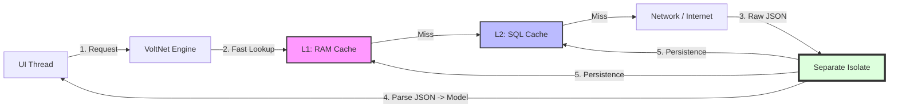

# VoltNet 🚀

[](https://github.com/felippe-flutter-dev/volt_net/actions)
[](https://pub.dev/packages/volt_net)
[](https://pub.dev/packages/volt_net/score)
[](https://github.com/felippe-flutter-dev/volt_net)
[](https://www.linkedin.com/in/felippe-pinheiro-dev-flutter/)

**Technologies:** 


**VoltNet** is a high-performance HTTP request engine for Flutter, designed for applications that require total UI fluidity and resilience in unstable network conditions.

It utilizes a **Hybrid Cache (L1/L2)** architecture and processing in **Isolates** to ensure the main thread never suffers from "jank" (stuttering), even when handling large volumes of data.

---

## 🏗️ Communication Architecture

VoltNet acts as an intelligent layer between your UI and the server. Below is the general data processing flow:



---

## 🚀 Initialization

Before using, VoltNet needs to configure the SQLite environment and the synchronization engine.

```dart
void main() async {
  WidgetsFlutterBinding.ensureInitialized();
  
  await Volt.initialize(
    databaseName: 'my_app.db', // SQLite filename
    maxMemoryItems: 150,        // RAM (L1) object limit
    enableSync: true,           // Enables Offline Sync engine
  );

  runApp(MyApp());
}
```

---

## 📡 GET Requests (Intelligent Caching)

The GET flow prioritizes speed, checking cache levels before hitting the network.

```dart
final getRequest = GetRequest();

// Example: Fetch profile with 1-hour cache
final user = await getRequest.getModel<UserModel>(
  MyApiConfig(),
  '/profile',
  UserModel.fromJson,
  cacheEnabled: true,
  type: CacheType.both,
  ttl: Duration(hours: 1),
);
```

### Decision Flow:
1. **RAM (L1)**: Returns instantly.
2. **SQL (L2)**: Checks TTL. If valid, promotes to L1 and returns.
3. **Network**: If cache misses or expires, fetches from API, parses in **Isolate**, and updates both caches.

---

## 📮 POST Requests & Offline First

VoltNet allows POST requests to be "queued" if the user is offline, ensuring data is never lost.

```dart
final postRequest = PostRequest();

// Automatically saves to queue if network fails
final result = await postRequest.post(
  MyApiConfig(),
  endpoint: '/comment',
  data: {'text': 'Great article!'},
  offlineSync: true,
);

if (result.isPending) {
  print('You are offline. The comment will be sent automatically once connection is restored!');
}
```

---

## 💾 Dynamic Persistence (SqlModel)

Turn any class into a SQL table without writing `CREATE TABLE`.

```dart
class LocalConfig extends SqlModel {
  final String theme;
  LocalConfig(this.theme);

  @override
  String get tableName => 'settings';

  @override
  Map<String, String> get tableSchema => {'id': 'INTEGER PRIMARY KEY', 'theme': 'TEXT'};

  @override
  Map<String, dynamic> toSqlMap() => {'id': 1, 'theme': theme};
}

// To Save:
await CacheManager().saveModel(LocalConfig('dark'));
```

---

## 🧪 Quality & Testing

The framework has a rigorous test suite with **92.7%** coverage, including:
- Unstable network simulations.
- Corrupted cache handling and automatic recovery.
- Database concurrency tests.

To run tests:
```bash
flutter test --coverage
```

---

*Developed by [Felippe Pinheiro de Almeida](https://www.linkedin.com/in/felippe-pinheiro-dev-flutter/) with a focus on performance and scalability.* 🚀

Official Repository: [volt_net](https://github.com/felippe-flutter-dev/volt_net)

<details>
<summary><b>🇧🇷 Português (PT-BR) - Clique para expandir</b></summary>

### Resumo em Português
O **VoltNet** é um motor de requisições de alta performance focado em:
- **Cache Híbrido**: RAM (L1) para velocidade e SQLite (L2) para persistência.
- **Isolates**: Todo processamento pesado de JSON ocorre fora da thread principal da UI.
- **Offline First**: Fila de sincronização automática para requisições POST quando não há rede.
- **Simplicidade**: Abstração total do SQL através do `SqlModel`.
</details>
