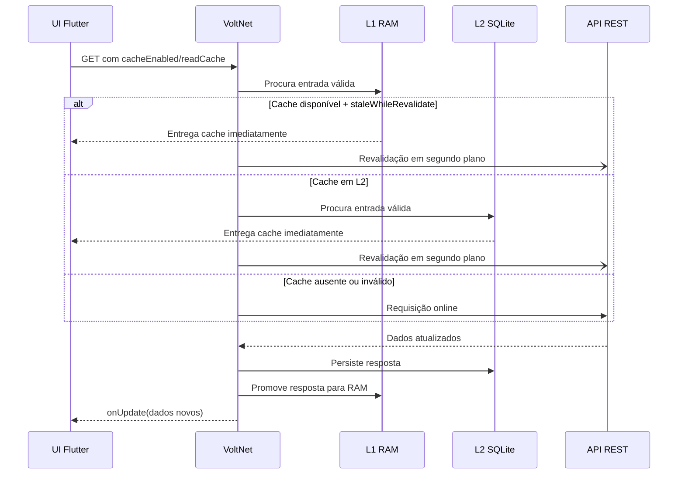
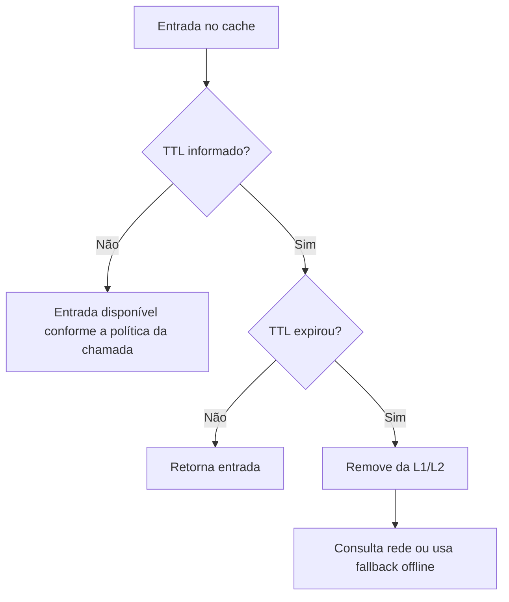
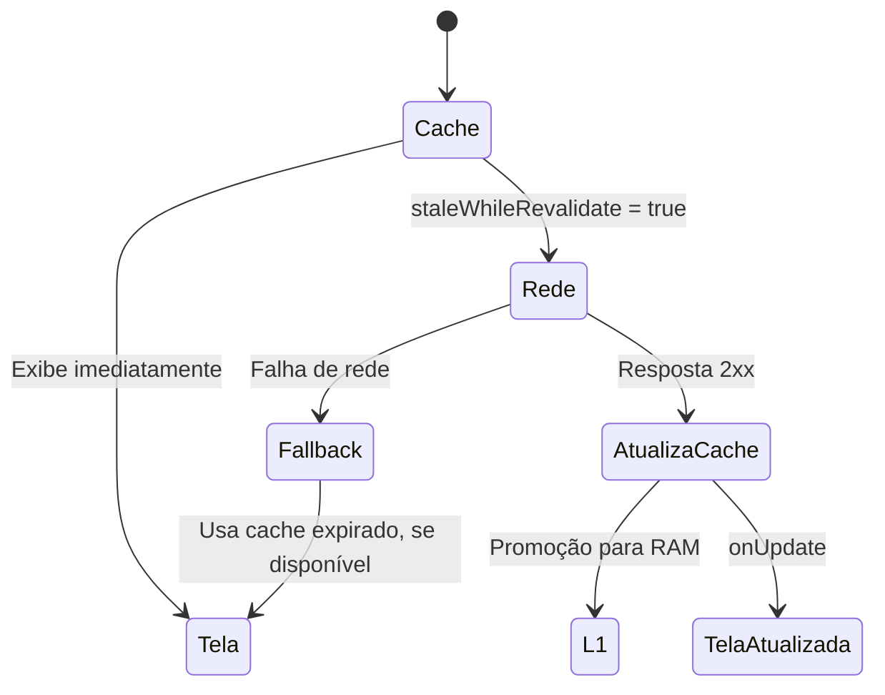

# volt_net

[](https://pub.dev/packages/volt_net)
[](https://github.com/felippe-flutter-dev/volt_net)
[](https://opensource.org/licenses/MIT)

O **volt_net** é uma camada de orquestração HTTP para aplicações Flutter que precisam de desempenho, resiliência offline, cache híbrido e parsing de JSON fora da thread principal. A biblioteca é agnóstica ao backend e trabalha com APIs REST convencionais.

## Principais recursos

| Recurso | Descrição |
|---|---|
| **Cache híbrido** | Cache L1 em RAM e L2 persistente em SQLite, com TTL e remoção física de entradas expiradas. |
| **Stale-while-revalidate** | Exibe o cache imediatamente e consulta a API em seguida, emitindo o dado atualizado por callback. |
| **Network-first** | O fluxo padrão de GET consulta a rede; o cache pode ser usado explicitamente como leitura antecipada ou fallback offline. |
| **Offline Sync** | POST, PUT e DELETE podem ser enfileirados e reenviados quando a conectividade retornar. |
| **Parsing em isolate** | `getModelResult`, `getListResult` e `postModel` processam JSON fora da thread principal. |
| **Interceptors** | Interceptação centralizada de requisições, respostas e erros. |
| **Debounce** | Redução de chamadas repetidas em buscas e ações de alta frequência. |
| **Resilient Batch** | Execução sequencial de operações com idempotência e rollback local. |
| **Logging e CURL** | Logs estruturados e comandos CURL para depuração quando `logging` está habilitado. |

## Arquitetura

O fluxo padrão é **network-first**. Quando o modo stale-while-revalidate está habilitado e a chamada permite leitura de cache, a aplicação recebe o valor persistido sem esperar a rede. A consulta online continua imediatamente; quando concluída, a resposta é salva em disco, promovida para L1 e entregue ao callback `onUpdate`.


```mermaid
sequenceDiagram
    participant UI as UI Flutter
    participant VN as VoltNet
    participant L1 as L1 RAM
    participant L2 as L2 SQLite
    participant API as API REST

    UI->>VN: GET com cacheEnabled/readCache
    VN->>L1: Procura entrada válida
    alt Cache disponível + staleWhileRevalidate
        L1-->>UI: Entrega cache imediatamente
        VN-)API: Revalidação em segundo plano
    else Cache em L2
        VN->>L2: Procura entrada válida
        L2-->>UI: Entrega cache imediatamente
        VN-)API: Revalidação em segundo plano
    else Cache ausente ou inválido
        VN->>API: Requisição online
    end

    API-->>VN: Dados atualizados
    VN->>L2: Persiste resposta
    VN->>L1: Promove resposta para RAM
    VN-->>UI: onUpdate(dados novos)
```

### Expiração e limpeza do cache

O TTL é aplicado no momento da leitura. Quando uma entrada persistida ultrapassa o TTL informado, ela deixa de ser retornada e o registro correspondente é removido do SQLite. O cache em memória também remove a entrada expirada da L1.


```mermaid
flowchart TD
    A[Entrada no cache] --> B{TTL informado?}
    B -- Não --> C[Entrada disponível conforme a política da chamada]
    B -- Sim --> D{TTL expirou?}
    D -- Não --> E[Retorna entrada]
    D -- Sim --> F[Remove da L1/L2]
    F --> G[Consulta rede ou usa fallback offline]
```

### Stale-while-revalidate

Ative a política global antes de `runApp`. A configuração não bloqueia a inicialização da aplicação e passa a valer para chamadas que usam `readCache: true`.


```mermaid
stateDiagram-v2
    [*] --> Cache
    Cache --> Tela: Exibe imediatamente
    Cache --> Rede: staleWhileRevalidate = true
    Rede --> AtualizaCache: Resposta 2xx
    AtualizaCache --> L1: Promoção para RAM
    AtualizaCache --> TelaAtualizada: onUpdate
    Rede --> Fallback: Falha de rede
    Fallback --> Tela: Usa cache expirado, se disponível
```

## Configuração no `main.dart`

A inicialização deve ocorrer depois de `WidgetsFlutterBinding.ensureInitialized()` e antes de `runApp`.

```dart
import 'package:flutter/material.dart';
import 'package:volt_net/volt_net.dart';

Future<void> main() async {
  WidgetsFlutterBinding.ensureInitialized();

  await Volt.initialize(
    databaseName: 'volt_net_cache.db',
    maxMemoryItems: 200,
    enableSync: true,
    defaultTimeout: const Duration(seconds: 20),
    logging: true,
    staleWhileRevalidate: true,
  );

  runApp(const MyApp());
}
```

Os parâmetros principais são `databaseName`, `maxMemoryItems`, `enableSync`, `defaultTimeout`, `logging` e `staleWhileRevalidate`. Para receber o cache imediatamente, a chamada também precisa usar `cacheEnabled: true`, `type` e `readCache: true`.

## Configuração de URL e autenticação

A aplicação deve fornecer uma implementação de `BaseApiUrlConfig` para centralizar URL base, headers e token.

```dart
class ApiConfig extends BaseApiUrlConfig {
  @override
  String resolveBaseUrl() => 'https://api.exemplo.com/v1';

  @override
  Future<Map<String, String>> getHeader() async => {
        'Accept': 'application/json',
        'Content-Type': 'application/json',
      };

  @override
  Future<String> getToken() async {
    // Leia o token do armazenamento seguro da aplicação.
    return 'Bearer token-da-aplicacao';
  }
}
```

## GET

### GET network-first

O GET padrão consulta a rede e salva respostas bem-sucedidas quando o cache está habilitado.

```dart
final request = GetRequest<ApiConfig>();
final config = ApiConfig();

final result = await request.get(
  config,
  '/users',
  cacheEnabled: true,
  type: CacheType.both,
  ttl: const Duration(minutes: 5),
);

if (result.isSuccess) {
  print(result.jsonBody);
}
```

### GET com cache imediato e atualização da UI

Para telas como home, feed ou dashboard, use `readCache: true`, `staleWhileRevalidate: true` e `onUpdate`. A primeira resposta pode ser o cache; a resposta online será emitida depois sem bloquear a primeira renderização.

```dart
class FeedPageState extends State<FeedPage> {
  final request = GetRequest<ApiConfig>();
  final config = ApiConfig();
  ResultApi? feed;

  Future<void> loadFeed() async {
    final immediate = await request.get(
      config,
      '/feed',
      cacheEnabled: true,
      type: CacheType.both,
      readCache: true,
      ttl: const Duration(minutes: 5),
      staleWhileRevalidate: true,
      onUpdate: (fresh) {
        if (!mounted) return;
        setState(() => feed = fresh);
      },
    );

    if (!mounted) return;
    setState(() => feed = immediate);
  }
}
```

Quando o modo global estiver ativo, `staleWhileRevalidate` pode ser omitido na chamada. O parâmetro por requisição permite substituir a configuração global quando necessário.

### GET com parsing em isolate

```dart
final result = await request.getModelResult<User>(
  config,
  '/profile',
  User.fromJson,
  cacheEnabled: true,
  type: CacheType.both,
  ttl: const Duration(minutes: 5),
);

if (result.isSuccess && result.model != null) {
  print(result.model!.name);
}
```

Para listas, use `getListResult<T>` com o mesmo padrão de configuração.

## POST

POST suporta JSON, multipart, cancelamento e fila offline.

```dart
final postRequest = PostRequest<ApiConfig>();

final result = await postRequest.post(
  config,
  endpoint: '/posts',
  data: {
    'title': 'Novo post',
    'body': 'Conteúdo do post',
  },
  offlineSync: true,
);

if (result.isPending) {
  print('POST enfileirado para sincronização posterior.');
}
```

Com parsing tipado:

```dart
final result = await postRequest.postModel<Post>(
  config,
  '/posts',
  Post.fromJson,
  data: {'title': 'Novo post'},
  offlineSync: true,
);
```

Para upload, envie `isMultipart: true` e use `VoltFile` nos campos correspondentes.

## PUT / UPDATE

O pacote expõe `PutRequest.put`. Ele representa a operação de **update** completo de um recurso REST. Não existe um método chamado `update`; quando a aplicação usa esse conceito, deve chamar `put`.

```dart
final putRequest = PutRequest<ApiConfig>();

final result = await putRequest.put(
  config,
  endpoint: '/users/42',
  data: {
    'name': 'Nome atualizado',
    'email': 'novo@email.com',
  },
  offlineSync: true,
);
```

## PATCH

A versão atual do `volt_net` não expõe uma classe ou método `PatchRequest`. Portanto, não documentamos um snippet que pareça suportado pela API atual. Para alterações completas, use `PutRequest.put`. O suporte nativo a PATCH está previsto no roadmap.

Quando o backend exigir PATCH, a implementação deverá incluir método HTTP PATCH, suporte correspondente na fila offline e testes específicos antes de ser considerada parte da API pública.

## DELETE

DELETE também pode ser enfileirado para sincronização quando a aplicação estiver offline.

```dart
final deleteRequest = DeleteRequest<ApiConfig>();

final result = await deleteRequest.delete(
  config,
  endpoint: '/posts/42',
  offlineSync: true,
);

if (result.isPending) {
  print('DELETE enfileirado para sincronização posterior.');
}
```

## Interceptors

Interceptors são úteis para refresh de token, cabeçalhos dinâmicos, telemetria e tratamento centralizado de erros.

```dart
class ApiInterceptor extends VoltInterceptor {
  @override
  FutureOr<http.BaseRequest> onRequest(http.BaseRequest request) async {
    request.headers['X-App-Version'] = '1.0.0';
    return request;
  }

  @override
  FutureOr<http.Response> onResponse(http.Response response) async {
    return response;
  }

  @override
  void onError(dynamic error) {
    // Encaminhe o erro para o sistema de observabilidade.
  }
}

void registerInterceptors() {
  Volt.addInterceptor(ApiInterceptor());
}
```

## Debounce e operações em lote

```dart
final result = await request.getWithDebounce(
  config,
  '/search',
  queryParameters: {'q': 'flutter'},
  delay: const Duration(milliseconds: 400),
);
```

Para operações dependentes, use `resilientBatch` com idempotência e rollback local.

```dart
final results = await postRequest.resilientBatch(
  [
    ({extraHeaders}) => postRequest.post(
          config,
          endpoint: '/addresses',
          data: {'city': 'São Paulo'},
          extraHeaders: extraHeaders,
        ),
    ({extraHeaders}) => postRequest.post(
          config,
          endpoint: '/orders',
          data: {'total': 100},
          extraHeaders: extraHeaders,
        ),
  ],
  idempotencyKey: 'checkout-123',
  rollbackOnFailure: true,
  onRollback: (successfulSteps) async {
    // Rever o estado local quando uma etapa posterior falhar.
  },
);
```

## Persistência SQL customizada

```dart
class LocalMessage extends SqlModel {
  final String content;

  LocalMessage(this.content);

  @override
  String get tableName => 'local_messages';

  @override
  Map<String, String> get tableSchema => {
        'id': 'INTEGER PRIMARY KEY AUTOINCREMENT',
        'content': 'TEXT',
      };

  @override
  Map<String, dynamic> toSqlMap() => {'content': content};
}

await CacheManager().saveModel(LocalMessage('Mensagem local'));
```

## Roadmap

O roadmap detalhado está em [`ROADMAP.md`](ROADMAP.md). A versão resumida é:

| Status | Entrega |
|---|---|
| Concluído | Cache híbrido L1/L2, TTL, limpeza de entradas expiradas e network-first. |
| Concluído | Stale-while-revalidate configurável, promoção automática para L1 e callback `onUpdate`. |
| Concluído | Logging, CURL, interceptors, parsing em isolate, offline sync e resilient batch. |
| Planejado | API nativa de PATCH com suporte à fila offline. |
| Planejado | Persistência alternativa para Web sem SQLite. |
| Planejado | Suporte GraphQL opcional. |

## Licença

Desenvolvido por **Felippe Pinheiro de Almeida** sob a licença MIT.

- [Pub.dev](https://pub.dev/packages/volt_net)
- [GitHub](https://github.com/felippe-flutter-dev/volt_net)
- [Changelog](CHANGELOG.md)
- [Roadmap](ROADMAP.md)
