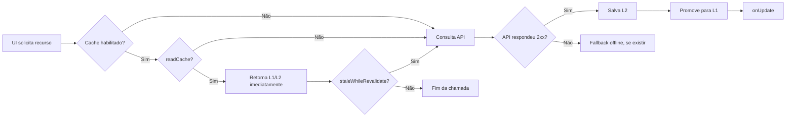

# Roadmap do volt_net

Este roadmap acompanha a evolução técnica do `volt_net` como uma camada de rede resiliente para aplicações Flutter.

## Estado atual

| Marco | Estado | Entregas |
|---|---|---|
| **v2.0** | Concluído | REST, `PutRequest`, `DeleteRequest`, fila offline, uploads multipart, interceptors, `ResultModel<T>` e resilient batch. |
| **v2.1** | Concluído | Logging estruturado, geração de CURL, padronização de erros e documentação inline. |
| **v2.1.1** | Em preparação | Cache network-first, TTL com remoção física no SQLite, stale-while-revalidate, promoção automática para L1, callback `onUpdate` e documentação atualizada. |

## Cache e revalidação

A política atual separa três responsabilidades: entregar rapidamente um valor já disponível, consultar a origem online e atualizar a memória persistente para as próximas telas.

## Próximos marcos

### v2.2 — Suporte Web e persistência multiplataforma

O objetivo é oferecer uma estratégia de persistência alternativa para plataformas nas quais SQLite não esteja disponível ou não seja a opção ideal. A camada deverá preservar as mesmas garantias de TTL, isolamento por token e limpeza de entradas expiradas.

### v2.3 — PATCH nativo

Adicionar `PatchRequest` ou um método PATCH à API pública, incluindo headers, interceptors, timeout, mapeamento de erros e persistência na fila offline. A implementação deverá distinguir PATCH de PUT: PATCH altera parcialmente um recurso; PUT substitui sua representação completa.

### v2.4 — Callbacks tipados para revalidação

Expandir o callback `onUpdate` para `getModelResult<T>` e `getListResult<T>`, evitando que a aplicação precise converter manualmente o `ResultApi` recebido na revalidação.

### v2.5 — GraphQL opcional

Adicionar uma camada opcional para queries e mutations GraphQL sem acoplar o núcleo REST atual. O cache deverá permitir chaves baseadas em operação, variáveis e identidade do usuário.

### v3.0 — Observabilidade e políticas avançadas

Planejar métricas de cache hit/miss, duração de rede, quantidade de revalidações, falhas de sincronização e políticas configuráveis de retry, backoff e invalidação por grupo.

## Critérios de qualidade

Cada marco deve incluir testes unitários e de integração, documentação dos contratos públicos, exemplos executáveis e compatibilidade explícita entre Android, iOS, desktop e Web quando aplicável.

As mudanças de comportamento que alterem defaults públicos devem ser registradas no `CHANGELOG.md` e classificadas conforme o impacto semântico da API.
